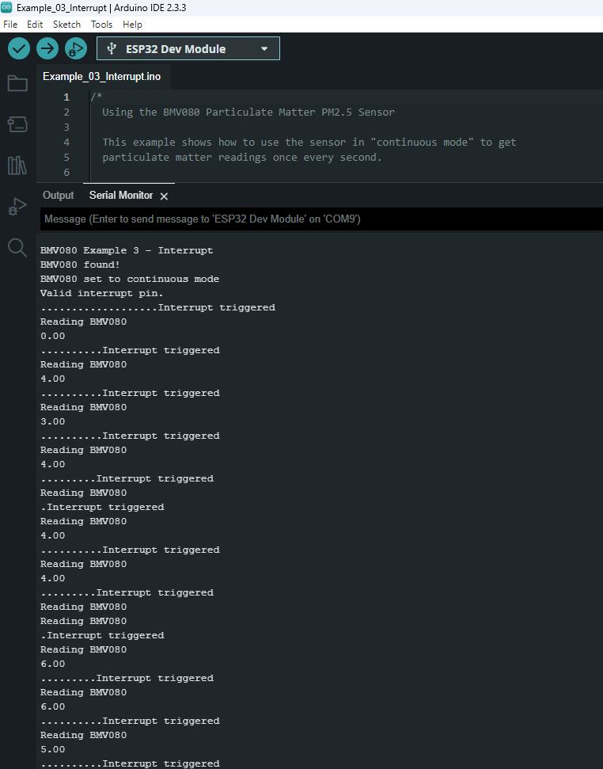

!!! note
    The interrupt example cannot be used when the BMV080 is in duty cycling mode.

This example shows how to read the BMV080 via Qwiic when the sensor is configured in continuous mode with a hardware interrupt. Similar to the first example, the output will show the amount of particulate matter that is detected. However, the sensor will trigger a hardware interrupt.

Head to the example 3 from the Arduino IDE's menu (located in **File** **Examples** > **SparkFun BMV080 Arduino Library** > **Example_03_Interrupt**).

If you have not already, select your Board and associated COM port. Upload the code to the board and set the [Arduino Serial Monitor](https://learn.sparkfun.com/tutorials/terminal-basics/all#arduino-serial-monitor-windows-mac-linux) to **115200** baud. The Arduino should begin outputting the sensor readings every 20 seconds.

[{ width="600"}](./assets/img/BMV080_Arduino_Example_03_Screenshot.png "Click to enlarge")

!!! tip
    You can view the timestamp of each sensor readings in the Arduino Serial Monitor by clicking on the "Toggle Timestamp" button. This button is represented as a clock above the baud rate.
