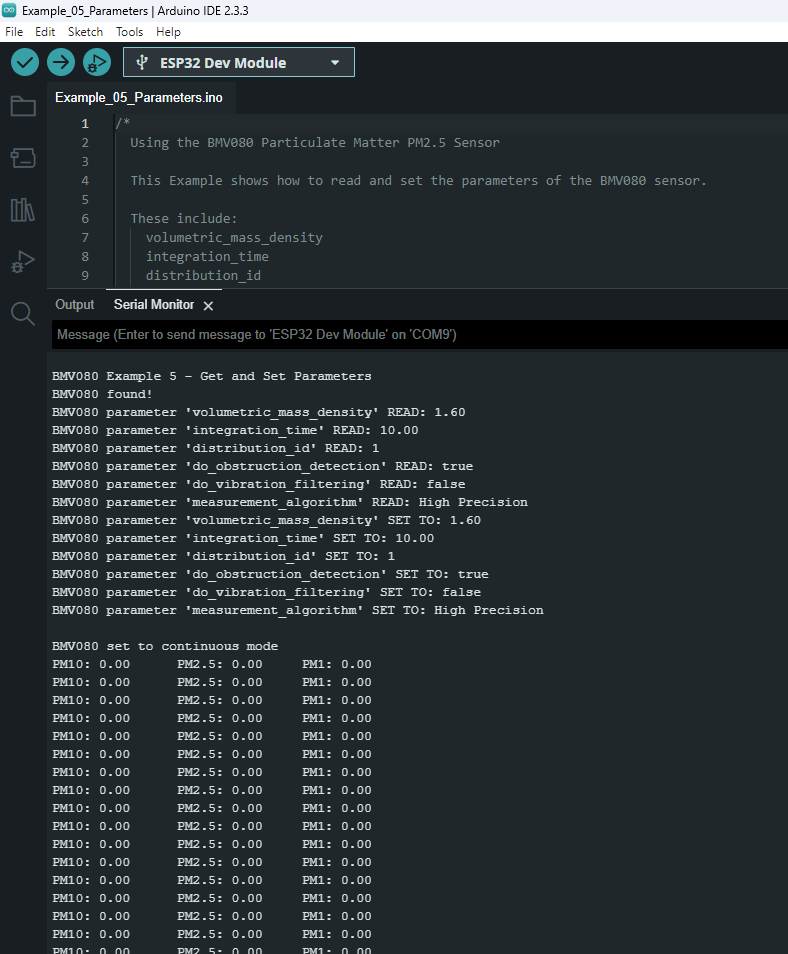

This example shows how to read and set the parameters of the BMV080 via Qwiic. These include `volumetric_mass_density`, `integration_time`, `distribution_id`, `do_obstruction_detection`, `do_vibration_filtering`, and  `measurement_algorithm`. Once these parameters are read and set, this example will then configure the sensor in continuous mode to read particulate mater every second.

Head to the example 5 from the Arduino IDE's menu (located in **File** **Examples** > **SparkFun BMV080 Arduino Library** > **Example_05_Parameters**).

If you have not already, select your Board and associated COM port. Upload the code to the board and set the [Arduino Serial Monitor](https://learn.sparkfun.com/tutorials/terminal-basics/all#arduino-serial-monitor-windows-mac-linux) to **115200** baud. The Arduino should output the paraemters before outputting the sensor readings every second.

[{ width="600"}](./assets/img/BMV080_Arduino_Example_05_Screenshot.png "Click to enlarge")

!!! note
    If you do not see the parameters after uploading, you may not have opened the Arduino Serial Monitor when the Arduino output the parameters. Try restarting your Arduino by hitting the reset button.
