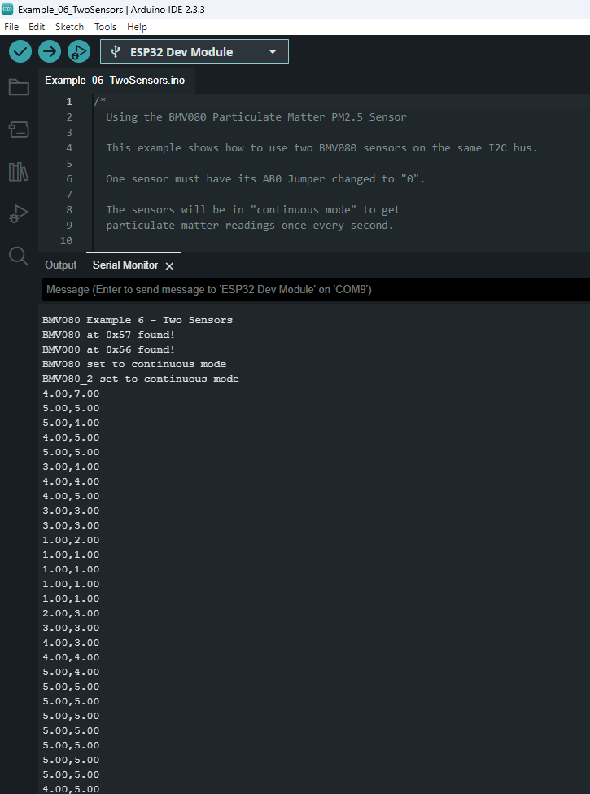

!!! note
    Make sure to have one sensor using the alternate I2C address. In this case, the second BMV080 had AB0 jumper changed to `0`.

This example shows how to read two BMV080 via Qwiic when each sensor is configured in continuous mode. The output will show the amount of particulate matter that is detected from both sensors.

Head to the example 6 from the Arduino IDE's menu (located in **File** **Examples** > **SparkFun BMV080 Arduino Library** > **Example_06_TwoSensors**).

If you have not already, select your Board and associated COM port. Upload the code to the board and set the [Arduino Serial Monitor](https://learn.sparkfun.com/tutorials/terminal-basics/all#arduino-serial-monitor-windows-mac-linux) to **115200** baud. The Arduino should begin outputting the sensor readings from both BMV080s.

[{ width="600"}](./assets/img/BMV080_Arduino_Example_06_Screenshot.png "Click to enlarge")

