### Connecting via Qwiic

By default, the sensor can be read through I2C. Connect a Qwiic cable between the SparkFun Qwiic Air Quality Sensor and your microcontroller. Then connect a compatible USB cable between the microcontroller and your computer's USB port.

[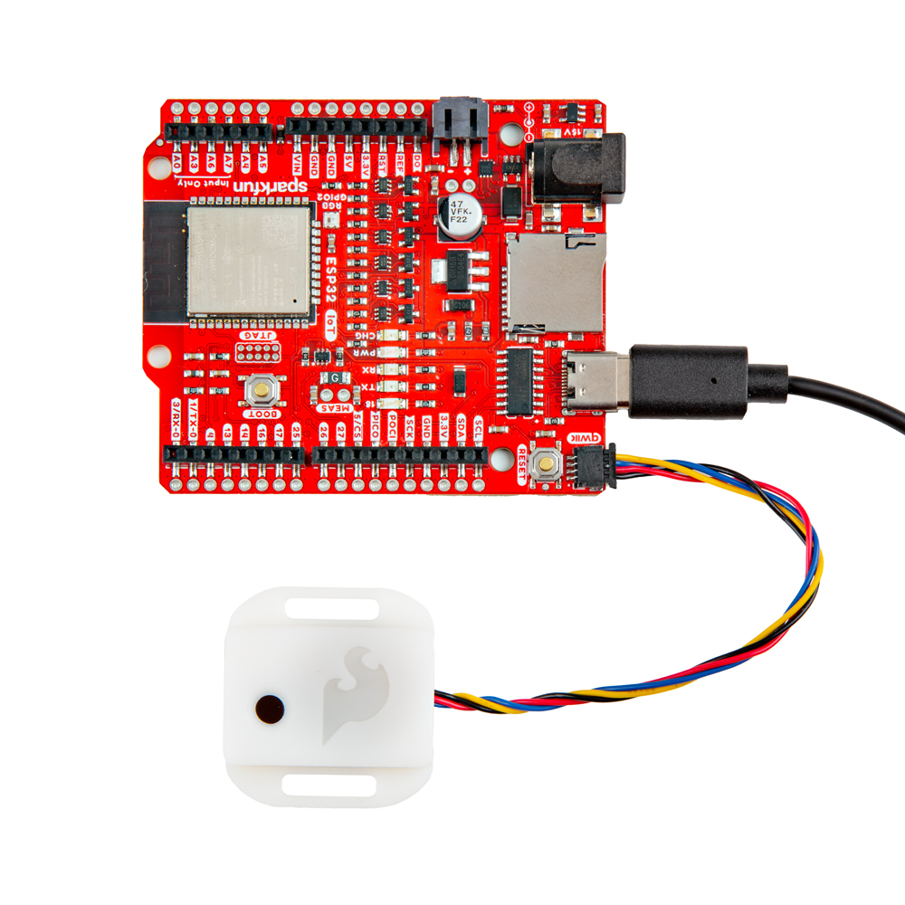{ width="600"}](./assets/img/BMV080_Qwiic_Assembly.jpg "Click to enlarge")

### Removing the BMV080 from the enclosure

The Particulate Matter Sensor - BMV080 comes housed in an enclosure to help protect the sensor during handling and installation. The enclosure does expose the solder jumpers and PTH pins for users to access while the board is inside the enclosure. While it is possible to access these parts of the board, we recommend removing the breakout from the enclosure prior to working with either the solder jumpers or PTH pins. 

We strongly recommend putting on Latex or Nitrile gloves (and **not** following our bad example in the photos below) before removing the board from the enclosure. Also, make sure to perform these steps on a **clean** and **flat** surface. Whether or not you decide to use gloves, do your best to avoid touching the enclosure's glass sensor cover and **do not** touch the bare sensor or any of the passive components (resistors/capacitors) near it:

[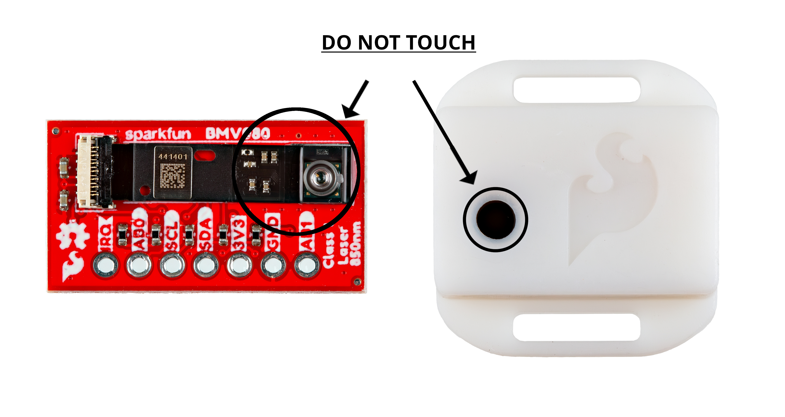{ width="600"}](./assets/img/BMV080_DO_NOT_TOUCH.jpg "Click to enlarge")

Start by identifying the two slots on either side of the enclosure. Next, carefully slide a precision flathead screwdriver or similar precise tool into one of the slots and gently wedge it under the tab. Rock the precision flathead's handle toward the mounting hole so the tab pops out.

[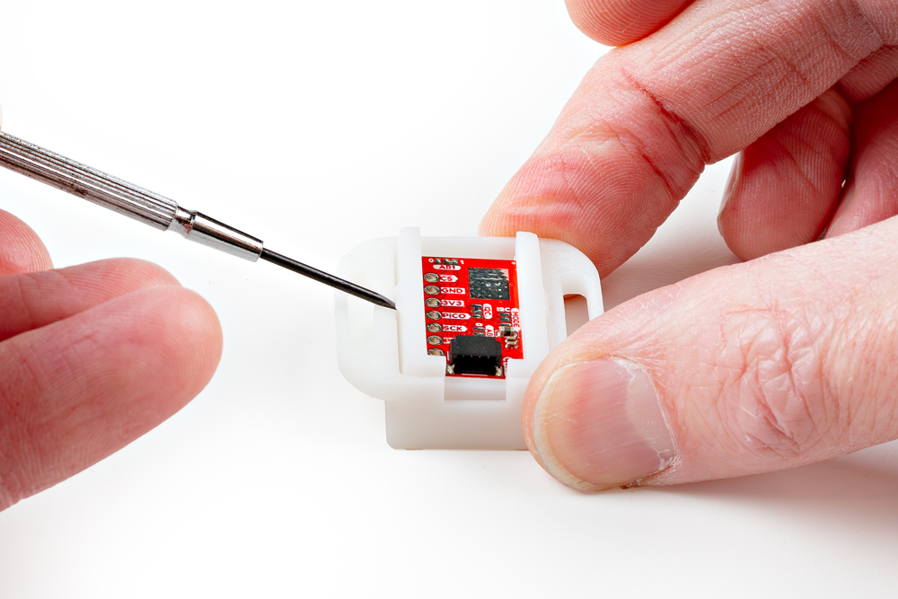{ width="600"}](./assets/img/BMV080_Unlocking_Enclosure.jpg "Click to enlarge")

Repeat this step on the other side to "unlock" the two pieces of the enclosure, then carefully remove the outer shell of the enclosure.

[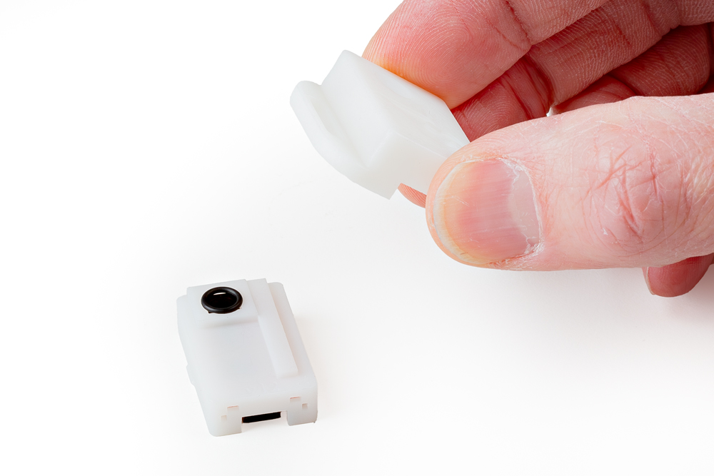{ width="600"}](./assets/img/BMV080_Removing_Outer_Shell.jpg "Click to enlarge")

Next, identify the rubber O-ring and lens cover (beneath the O-ring) covering the BMV080 aperture. Using tweezers, first remove the O-ring and then the lens cover. Make sure to place them on a clean surface to avoid contaminating them with dust or other substances:

[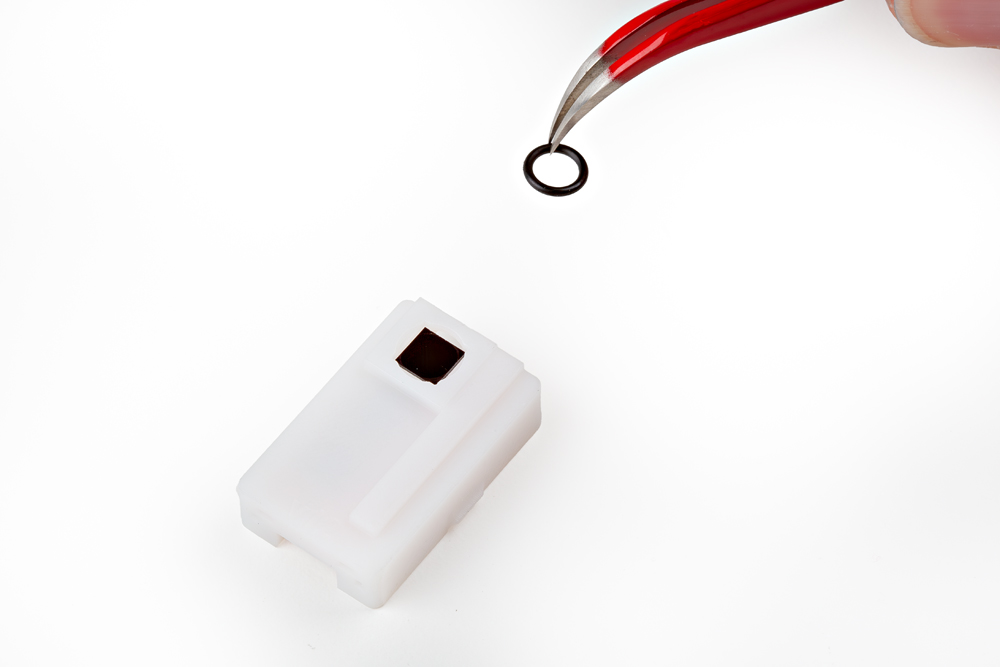{ width="600"}](./assets/img/BMV080_O-Ring_Removal.jpg "Click to enlarge")

[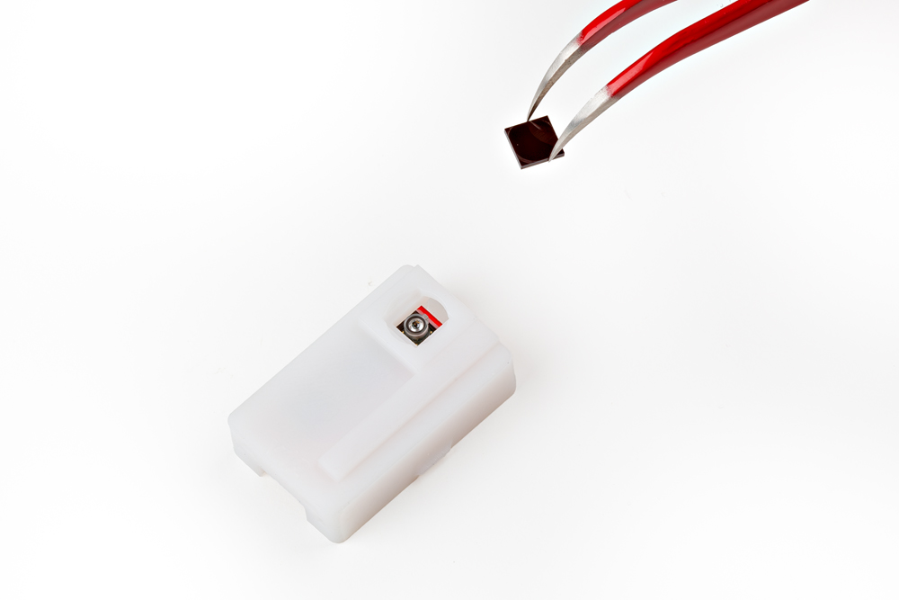{ width="600"}](./assets/img/BMV080_Lens_Cover_Removal.jpg "Click to enlarge")

With the O-ring and lens cover removed, the assembly should look like the photo below:

[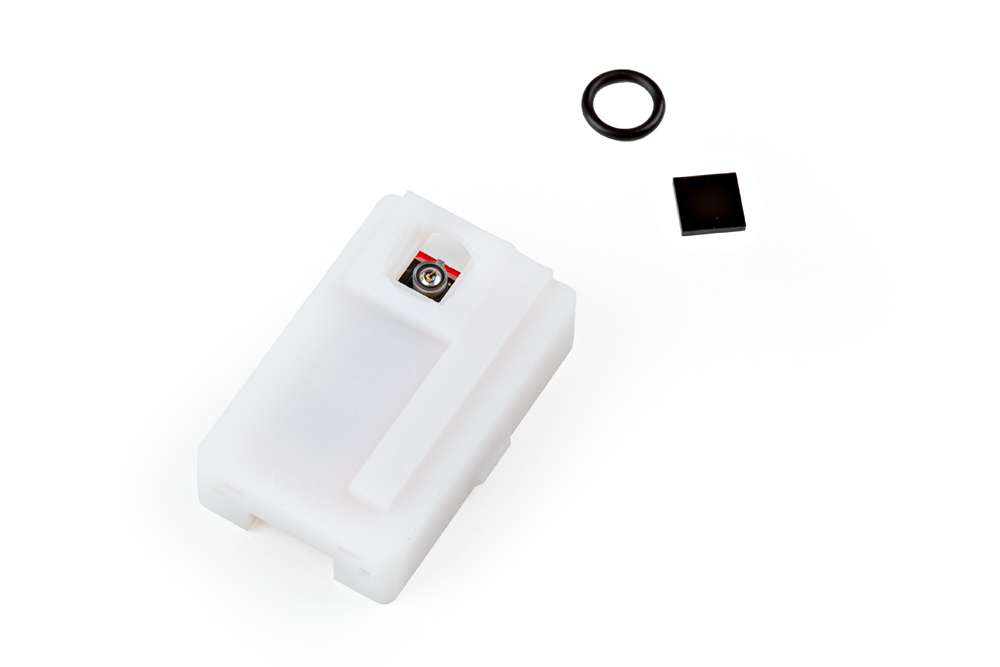{ width="600"}](./assets/img/BMV080_Inner_Shell_Parts.jpg "Click to enlarge")

The inner shell of the enclosure has a small notch to lock the breakout board into place inside. Using either your fingertip or tweezers, gently press down on the edge of the breakout board while pressing from the other side to slide the board out from the inner shell.

[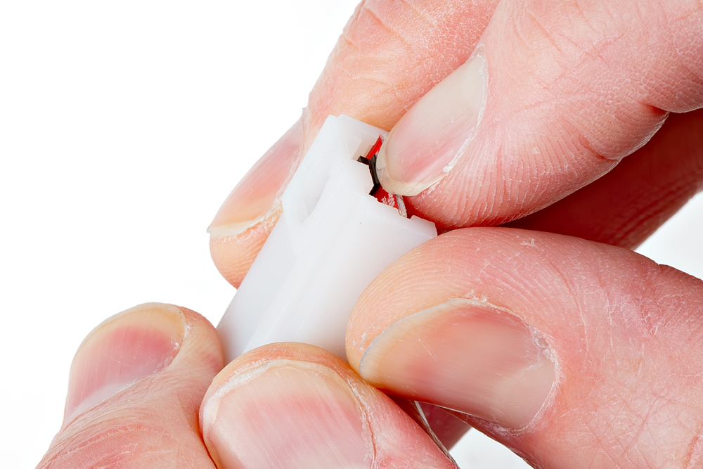{ width="600"}](./assets/img/BMV080_Notch_Pressed.jpg "Click to enlarge")

Slide the sensor out from the inner shell's slot while taking care to avoid touching the BMV080 sensor and passive components on the sensor's ribbon cable. 

[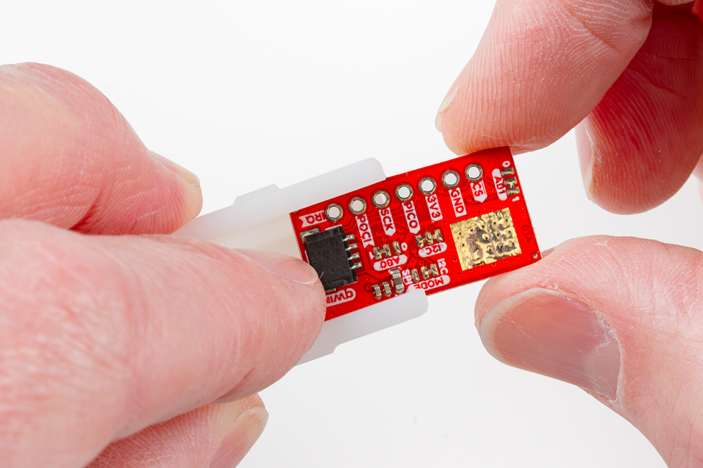{ width="600"}](./assets/img/BMV080_Removing_Breakout.jpg "Click to enlarge")

Now that the breakout board is out of the enclosure we can solder to the board and adjust the solder jumpers. If using male header pins, solder the short end from the top side of the board so that you can access the longer mating pins from the bottom side. If you're soldering wires, make sure to trim the leads as short as possible to avoid obstructing the board from sliding back into the enclosure. After soldering, carefully clean the solder joints to remove any flux residue left on the board using isopropyl alcohol and a Q-tip or other gentle cleaning tool.

!!! note
    When soldering make sure to not add too much solder. Excess solder can obstruct the breakout board from sliding back into the inner shell. For users soldering header pins, ensure that the header's plastic spacer is flush against the breakout board and not at an angle. For users soldering wire, ensure that the stripped wire is short.

### Reassembling the Enclosure

Once we're done modifying the breakout board we'll want to place the sensor back in the enclosure. This section goes over how to reassemble the parts but essentially we're just working backward through the previous steps.

Start by sliding the BMV080 breakout board back into the inner shell until it "clicks" back into place once it is past the notch. Make sure the BMV080 sensor and the Qwiic connector align with their respective apertures in the inner shell:

[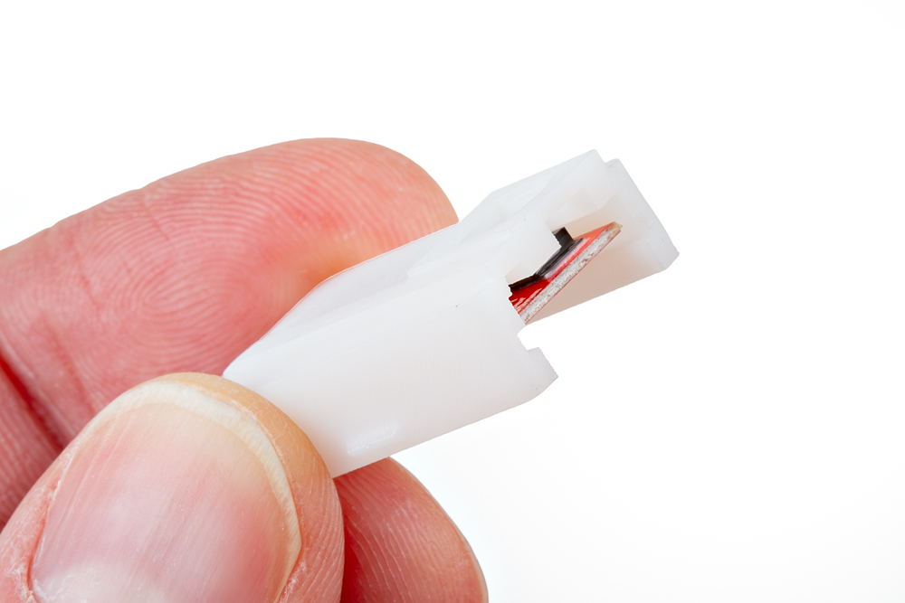{ width="600"}](./assets/img/BMV080_Breakout_Inserted.jpg "Click to enlarge")

Turn the enclosure over on a clean, flat surface. Using tweezers, place the lens cover over the hole where the BMV080's sensor is located. Then place the o-ring over lens cover. Ensure that the parts are in their respective square and circular slots.

[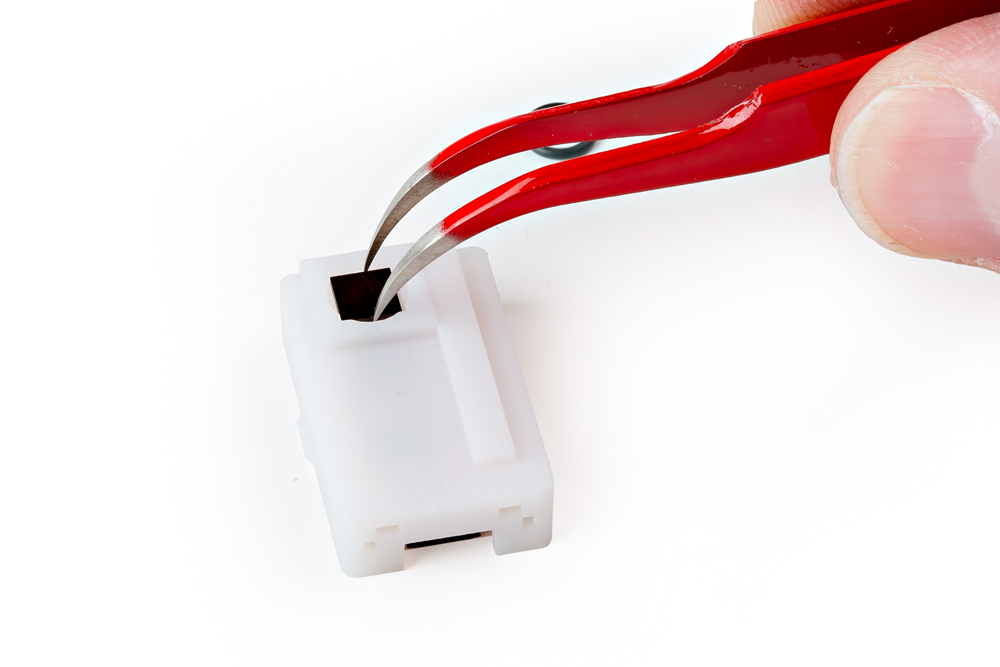{ width="600"}](./assets/img/BMV080_Lens_Cover_Replacement.jpg "Click to enlarge")

[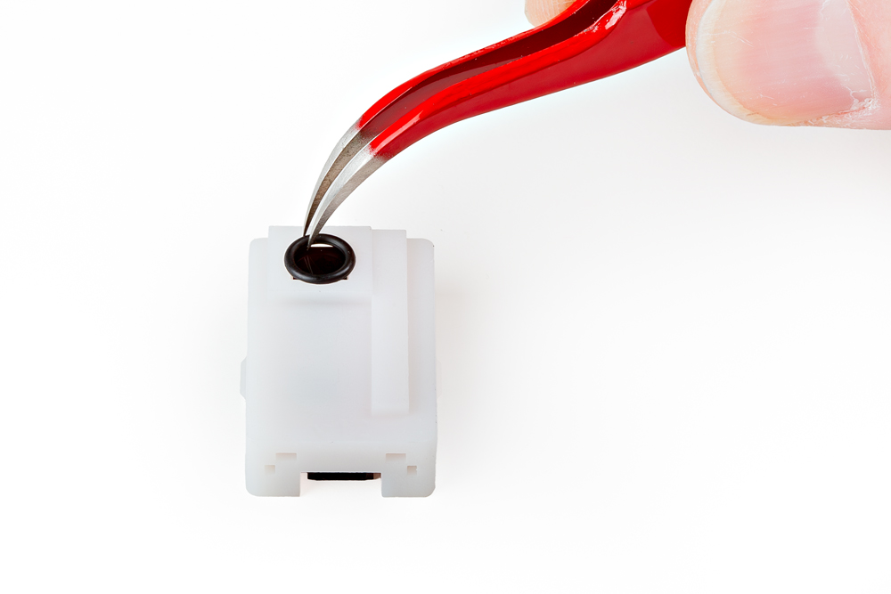{ width="600"}](./assets/img/BMV080_O-Ring_Replacement.jpg "Click to enlarge")

Now take the outer shell and place it back onto the inner shell making sure to align the apertures for the BMV080 and Qwiic connectors. Push down until you hear the tabs pop in.

[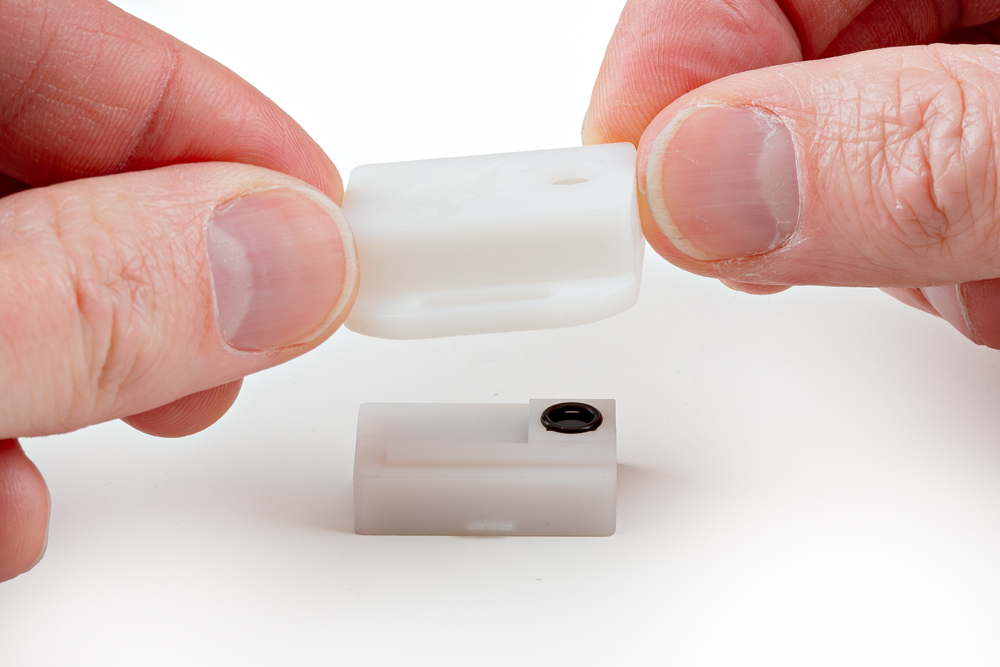{ width="600"}](./assets/img/BMV080_Replacing_Top_Shell.jpg "Click to enlarge")

[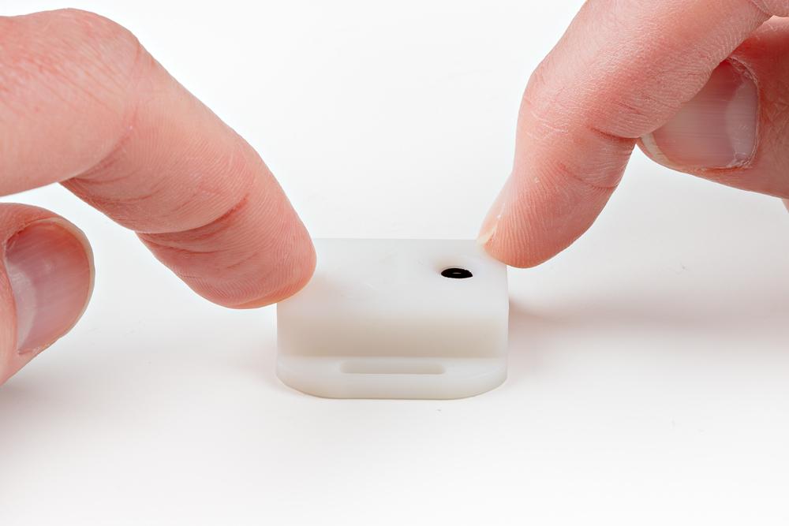{ width="600"}](./assets/img/BMV080_Securing_Outer_Shell.jpg "Click to enlarge")

### Connecting via PTH

!!! note
    When soldering directly to the PTHs, you will need to be careful of the 3D printed enclosure! You will want to carefully remove the board from the enclosure when soldering.

For temporary connections to the PTHs, you could use IC hooks to test out the pins. However, you'll need to solder headers or wires of your choice to the board for a secure connection. You can choose between a combination of [header pins and jumper wires](https://learn.sparkfun.com/tutorials/how-to-solder-through-hole-soldering/all), or [stripping wire and soldering the wire](https://learn.sparkfun.com/tutorials/working-with-wire/all) directly to the board.

-   <a href="https://learn.sparkfun.com/tutorials/how-to-solder-through-hole-soldering/all">
      <figure markdown>
        
      </figure>
    </a>

    ---

    <a href="https://learn.sparkfun.com/tutorials/how-to-solder-through-hole-soldering/all">
      <b>How to Solder: Through Hole Soldering</b>
    </a>
<!-- ----------WHITE SPACE BETWEEN GRID CARDS---------- -->

-   <a href="https://learn.sparkfun.com/tutorials/working-with-wire/all">
      <figure markdown>
        
      </figure>
    </a>

    ---

    <a href="https://learn.sparkfun.com/tutorials/working-with-wire/all">
      <b>Working with Wire</b>
    </a>
<!-- ----------WHITE SPACE BETWEEN GRID CARDS---------- -->

### Interrupt

The following table shows the connection that is required between an ESP32 and the SparkFUn Qwiic Air Quality Sensor when using I2C as the communication interface with interrupts.

    <table>
        <tr>
            <th style="text-align: center; border: solid 1px #cccccc;">ESP32 Pinout (i.e. IoT RedBoard - ESP32, ESP32 Thing Plus C, etc.)
            </th>
            <th style="text-align: center; border: solid 1px #cccccc;">SparkFun Qwiic Air Quality Sensor BMV080
            </th>
        </tr>
        <tr>
            <td style="text-align: center; border: solid 1px #cccccc;" bgcolor="#DDDDDD">GND
            </td>
            <td style="text-align: center; border: solid 1px #cccccc;" bgcolor="#DDDDDD">GND
            </td>
        </tr>
        <tr>
            <td style="text-align: center; border: solid 1px #cccccc;" bgcolor="#f2dede">3.3V
            </td>
            <td style="text-align: center; border: solid 1px #cccccc;" bgcolor="#f2dede">3V3
            </td>
        </tr>
        <tr>        
            <td style="text-align: center; border: solid 1px #cccccc;" bgcolor="#cce5ff">SDA
            </td>
            <td style="text-align: center; border: solid 1px #cccccc;" bgcolor="#cce5ff">SDA (PICO)
            </td>
        </tr>
        <tr>
            <td style="text-align: center; border: solid 1px #cccccc;" bgcolor="#fff3cd">SCL
            <td style="text-align: center; border: solid 1px #cccccc;" bgcolor="#fff3cd">SCL (SCK)
            </td>
        </tr>
        <tr>
            <td style="text-align: center; border: solid 1px #cccccc;" bgcolor="#d4edda">14
            </td>
            <td style="text-align: center; border: solid 1px #cccccc;" bgcolor="#d4edda">IRQ
            </td>
        </tr>
    </table>

### SPI

The following tables shows the connection that is required between between an ESP32 and the SparkFun Qwiic Air Quality Sensor when using SPI as the communication interface. You will need to cut the MODE jumper between the center pad and the pad labeled as I2C. Then add solder between the center pad and the pad labeled as SPI. Make sure to also leave the AB0 jumper open (i.e. both sides of the jumper are not connected).

    <table>
        <tr>
            <th style="text-align: center; border: solid 1px #cccccc;">ESP32 Pinout (i.e. IoT RedBoard - ESP32, ESP32 Thing Plus C, etc.)
            </th>
            <th style="text-align: center; border: solid 1px #cccccc;">SparkFun Qwiic Air Quality Sensor BMV080
            </th>
        </tr>
        <tr>
            <td style="text-align: center; border: solid 1px #cccccc;" bgcolor="#DDDDDD">GND
            </td>
            <td style="text-align: center; border: solid 1px #cccccc;" bgcolor="#DDDDDD">GND
            </td>
        </tr>
        <tr>
            <td style="text-align: center; border: solid 1px #cccccc;" bgcolor="#f2dede">3.3V
            </td>
            <td style="text-align: center; border: solid 1px #cccccc;" bgcolor="#f2dede">3V3
            </td>
        </tr>
        <tr>        
            <td style="text-align: center; border: solid 1px #cccccc;" bgcolor="#cce5ff">PICO
            </td>
            <td style="text-align: center; border: solid 1px #cccccc;" bgcolor="#cce5ff">PICO (SDA)
            </td>
        </tr>
        <tr>
            <td style="text-align: center; border: solid 1px #cccccc;" bgcolor="#d4edda">POCI
            </td>
            <td style="text-align: center; border: solid 1px #cccccc;" bgcolor="#d4edda">POCI (AB0)
            </td>
        </tr>
        <tr>
            <td style="text-align: center; border: solid 1px #cccccc;" bgcolor="#fff3cd">SCK
            <td style="text-align: center; border: solid 1px #cccccc;" bgcolor="#fff3cd">SCK (SCL)
            </td>
        </tr>
        <tr>
            <td style="text-align: center; border: solid 1px #cccccc;" bgcolor="#f2dede">CS
            </td>
            <td style="text-align: center; border: solid 1px #cccccc;" bgcolor="#f2dede">CS (AB1)
            </td>
        </tr>
    </table>

[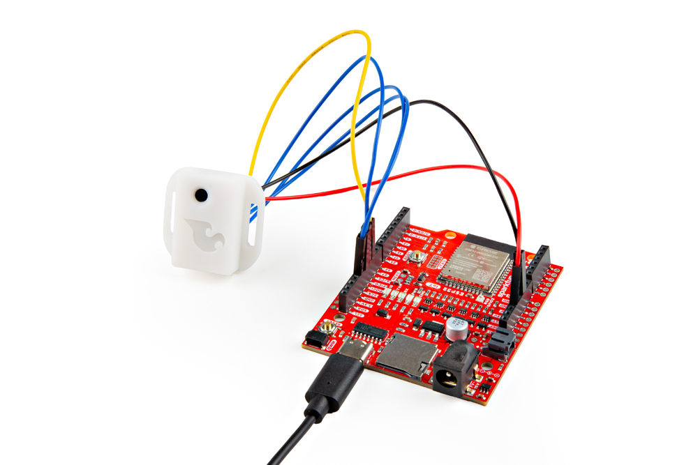{ width="600"}](./assets/img/BMV080_SPI_Assembly.jpg "Click to enlarge")

