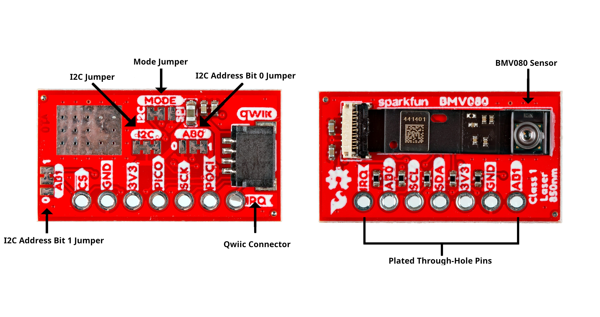
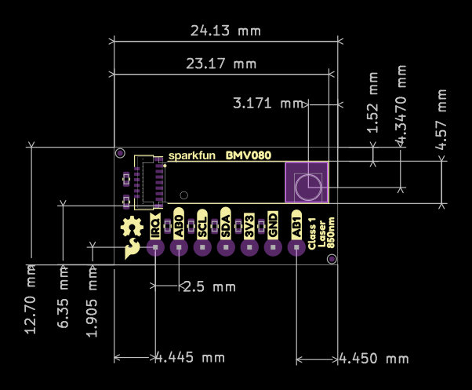

In this section, we will highlight the hardware and pins that are broken out on the SparkFun Qwiic Air Quality PM1/PM2.5/PM10 Sensor - BMV080. For more information, check out our [Resources and Going Further](../resources/) on the components used for the sensor.

[{ width="600"}](./assets/img/BMV080_Annotated.jpg "Click to enlarge")

### BMV080

The breakout board comes with Bosch's BMV080 populated and takes advantage of its flexible cable with the FPC 13-pin 0.33mm connector. The sensor is an ultra-small, fan-less air quality sensor for sensing PM1, PM2.5 and PM10 concentrations. A special lens allows the laser to pass through the enclosure to take measurements.

!!! Note
    This is a [CLASS 1](https://en.wikipedia.org/wiki/Laser_safety#Class_1) LASER PRODUCT CLASSIFIED IEC 60825-1 2014.

### Power

To power the board, you will need **3.3V**. You can connect a Qwiic cable to the Qwiic connector. Or you could solder directly to the PTHs. Below are the power pins that are broken out on the edge of the board.

* **3V3** - This pin is the voltage input for the board. The recommended input voltage for this pin is 3.3V.
* **GND** - Of course, is the common, ground voltage (0V reference) for the system.

### Qwiic and I2C

By default, the communication interface is set to I2C with the MODE jumper. The board includes one horizontal Qwiic connector to connect to other Qwiic-enabled I2C devices. However, the board still breaks out 0.1"-spaced pins for users who prefer a soldered connection.

* **SCL/SCK** - On the top side, the pin is labeled as SCL. On the bottom side, the pin is labeled as SCK. Thus the pin is used for the I2C clock.
* **SDA/PICO** - On the top side, the pin is labeled as SDA. On the bottom side, the pin is labeled as PICO. Thus the pin is used for the I2C data.

The default address of the BMV080 is set to **0x57** by default. By configuring AB1 and AB0 jumpers, you can adjust the I2C address to an alternative address. For more information, check below under the jumpers.

### Interrupt Pin

The board includes an interrupt pin when the board is set to I2C mode.

* **IRQ** &mdash; Short for interrupt. This pin sends an interrupt signal to a microcontroller.

!!! note
    The hardware interrupt of the BMV080 sensor unit cannot be used as trigger
    in duty cycling mode.

### SPI

The BMV080 can also be set to SPI as the communication interface by adjusting the MODE jumper on the back.

* **PICO/SDA** - On the bottom side, the pin is labeled as PICO (i.e. Peripheral In, Controller Out). On the top side, the pin is labeled as SDA.
* **POCI/AB0** - On the bottom side, the pin is labeled as POCI (i.e. Peripheral Out, Controller In). On the top side, the pin is labeled as AB0. When set to SPI mode, make sure to leave AB0 (POCI) open!
* **SCK/SCL** - On the bottom side, the pin is labeled as SCK for the clock. On the tip side, the pin is labeled as SCL.
* <b>CS</b> - On the bottom side, the pin is labeled as CS (i.e. chip select). On the top side, the pin is labeled as AB1. This pin is active low. When set to SPI mode, make sure to leave AB1 (CS) open!

### Jumpers

!!!note
    If this is your first time working with jumpers, check out the [How to Work with Jumper Pads and PCB Traces](https://learn.sparkfun.com/tutorials/how-to-work-with-jumper-pads-and-pcb-traces/all) tutorial for more information.

The back of the board has four jumpers to configure the board labeled **I2C**, **AB0**, **AB1** and **MODE**.

* **I2C** - By default, this three-pad jumper is closed. The three way jumper labeled I2C connects 3.3V to two 2.2k&ohm; pull-up resistors and to the I2C data and clock lines. If multiple devices are connected to the bus with the pull-up resistors enabled, the parallel equivalent resistance will create too strong of a pull-up for the bus to operate correctly. As a general rule of thumb, [disable all but one pair of pull-up resistors](https://learn.sparkfun.com/tutorials/i2c/all#i2c-at-the-hardware-level) if multiple devices are connected to the bus.
* **AB0** - Address jumper 0 when the BMV080 is set to I2C mode. This is a multifunctional pin. This is also connected to POCI. By default, the three-pad jumper's center pad is connected to the `1` side
* **AB1** - Address jumper 1 when the BMV080 is set to I2C mode. This is a multifunctional pin. This is also connected to CS. By default, the three-pad jumper's center pad is connected to the `1` side
* **MODE** - By default, this three-pad jumper is closed between the center pad and the pad labeled as I2C. Thus, the communication interface is set to I2C. Cutting this trace and adding solder between the center pad and the pad labeled as SPI will configure the communication interface as SPI.

When the SparkFun Qwiic Air Quality Sensor is configured in I2C mode, users have the ability to configure the default address using AB0 and AB1 jumpers. The following table shows the possible I2C address based on the jumper configuration.

    <table>
        <tr>
            <th style="text-align: center; border: solid 1px #cccccc;">AB1
            </th>
            <th style="text-align: center; border: solid 1px #cccccc;">AB0
            </th>
            <th style="text-align: center; border: solid 1px #cccccc;">I2C Address
            </th>
        </tr>
        <tr>
            <td style="text-align: center; border: solid 1px #cccccc;">0
            </td>
            <td style="text-align: center; border: solid 1px #cccccc;">0
            </td>
            <td style="text-align: center; border: solid 1px #cccccc;">0x54
            </td>
        </tr>
        <tr>
            <td style="text-align: center; border: solid 1px #cccccc;">0
            </td>
            <td style="text-align: center; border: solid 1px #cccccc;">1
            </td>
            <td style="text-align: center; border: solid 1px #cccccc;">0x55
            </td>
        </tr>
        <tr>
            <td style="text-align: center; border: solid 1px #cccccc;">1
            </td>
            <td style="text-align: center; border: solid 1px #cccccc;">0
            </td>
            <td style="text-align: center; border: solid 1px #cccccc;">0x56
            </td>
        </tr>
        <tr>
            <td style="text-align: center; border: solid 1px #cccccc;">1
            </td>
            <td style="text-align: center; border: solid 1px #cccccc;">1
            </td>
            <td style="text-align: center; border: solid 1px #cccccc;"><b>0x57 (default)</b>
            </td>
        </tr>
    </table>

!!! note
    AB0 is a multifunctional pin! When the SparkFun Qwiic Air Quality Sensor is configured for SPI, make sure to leave AB0 (POCI) open!

### 3D Model

A 3D model of the board and components was exported to a STEP file using KiCad.

<!-- Import the component -->

    <model-viewer src="../assets/3d_model/SparkFun_BMV080_v10_3D_model.glb" camera-controls poster="../assets/3d_model/SparkFun_BMV080_v10_3D_image.jpg" environment-image="legacy" shadow-intensity="1.58" exposure="0.64" shadow-softness="0.24" tone-mapping="neutral" camera-orbit="-46.67deg 57.14deg 153.3m" field-of-view="30deg" style="width: 750px; height: 500px;">
    </model-viewer>

 

    <a href="../assets/3d_model/SparkFun_BMV080_v10_3D_model.step" target="stp_file" class="md-button">Click Here for the STEP File</a>

### Board Dimensions

The board measures 0.5" x 0.95" (12.70mm x 24.13mm). The breakout board itself does not have mounting holes though the enclosure has two mounting slots to attach the sensor to your project.

[{ width="600"}](./assets/img/SparkFun_Particulate_Matter_Sensor_Breakout_BMV080_Board_Dimensions.png "Click to enlarge")

