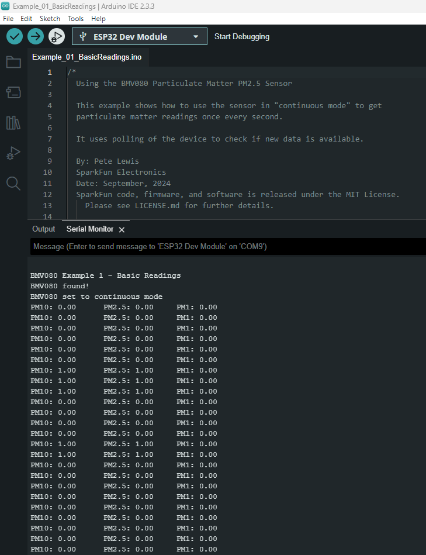

In this Quick Start guide we'll show how to get air quality measurements from the SparkFun Air Quality PM1/PM2.5/PM10 Sensor - BMV080 (Qwiic) and IoT RedBoard - ESP32 using the Arduino IDE. This guide assumes users are familiar with the Arduino IDE and Arduino development boards. You'll need the following items to follow along with this guide:

* [SparkFun Air Quality PM2/PM2.5/PM10 Sensor - BMV080 (Qwiic)](https://www.sparkfun.com/sparkfun-air-quality-pm1-pm2-5-pm10-sensor-bmv080-qwiic.html)
* [SparkFun IoT RedBoard - ESP32](https://www.sparkfun.com/sparkfun-iot-redboard-esp32-development-board.html)
* [Qwiic Cable](https://www.sparkfun.com/flexible-qwiic-cable-100mm.html)
* [USB-C Cable](https://www.sparkfun.com/reversible-usb-a-to-c-cable-0-8m.html)

If you're unfamiliar with any of the concepts covered here or would like more information about the Air Quality PM1/PM2.5/PM10 Sensor - BMV080 (Qwiic) read on to the following sections for detailed information about the BMV080 along with instructions on assembling it into a circuit, removing the breakout board from the enclosure and installing and using the BMV080 Arduino library.

## Basic Assembly

Start by connecting the Air Quality Sensor - BMV080 to the IoT RedBoard - ESP32 using a Qwiic cable and then connect the IoT RedBoard - ESP23 to your computer with a USB-C cable:

[{ width="600"}](./assets/img/BMV080_Qwiic_Assembly.jpg "Click to enlarge")

## Arduino Example 1 - Basic Readings

This example demonstrates the basics of initializing and reading air quality data from the BMV080 over I2C. Run "Example 01 - Basic Readings" by completing the following steps:

* Open the [Library Manager](https://docs.arduino.cc/software/ide-v2/tutorials/ide-v2-installing-a-library/) tool, search for "SparkFun BMV080" and install the latest version of the SparkFun BMV080 library.
* If necessary, open the [Boards Manager](https://docs.arduino.cc/software/ide-v2/tutorials/ide-v2-board-manager/) tool, search for "SparkFun ESP32" and install the latest version of the SparkFun ESP boards.
* In the Examples menu, open **Example_01_BasicReadings**.
* Select the Board (SparkFun ESP32 IoT RedBoard) and Port and click "Upload".
* Open the [Serial Monitor](https://docs.arduino.cc/software/ide-v2/tutorials/ide-v2-serial-monitor) with the baud set to **115200** to view particulate matter readings from the BMV080.

[{ width="600"}](./assets/img/BMV080_Arduino_Example_01_Screenshot.png)

