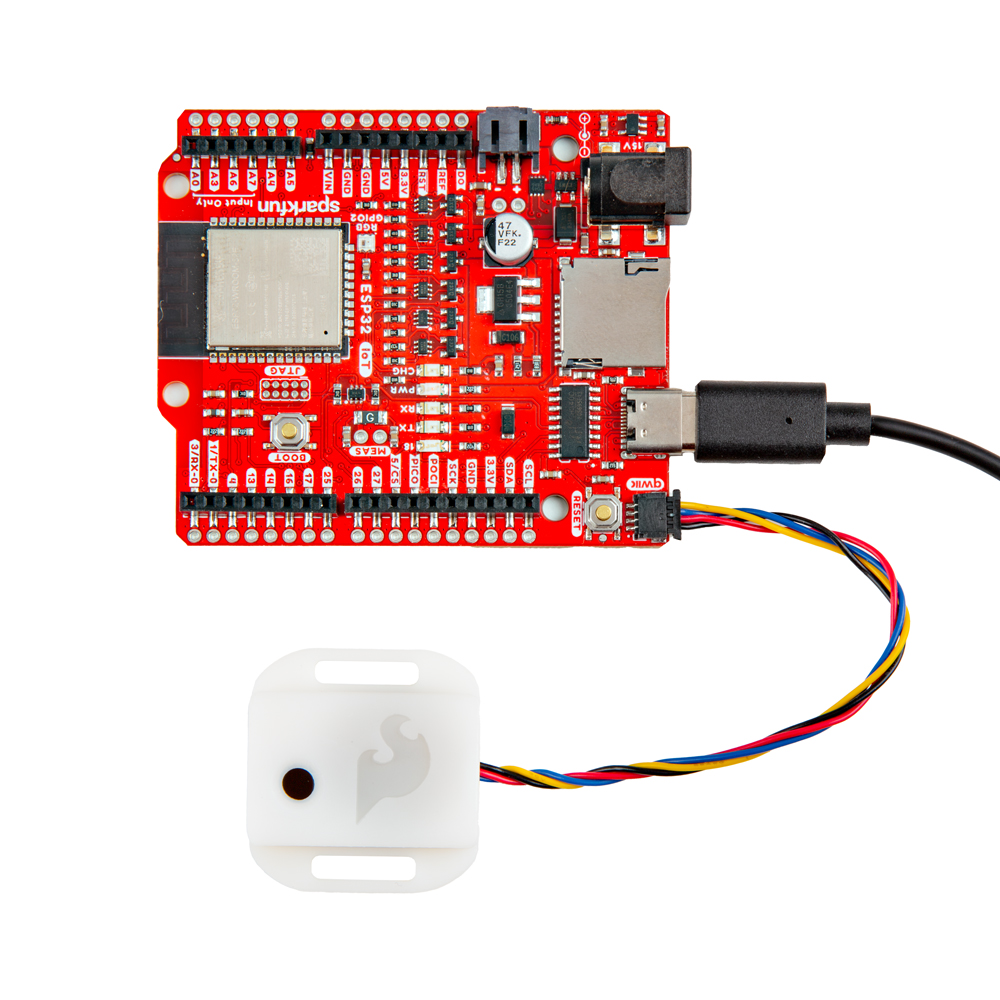
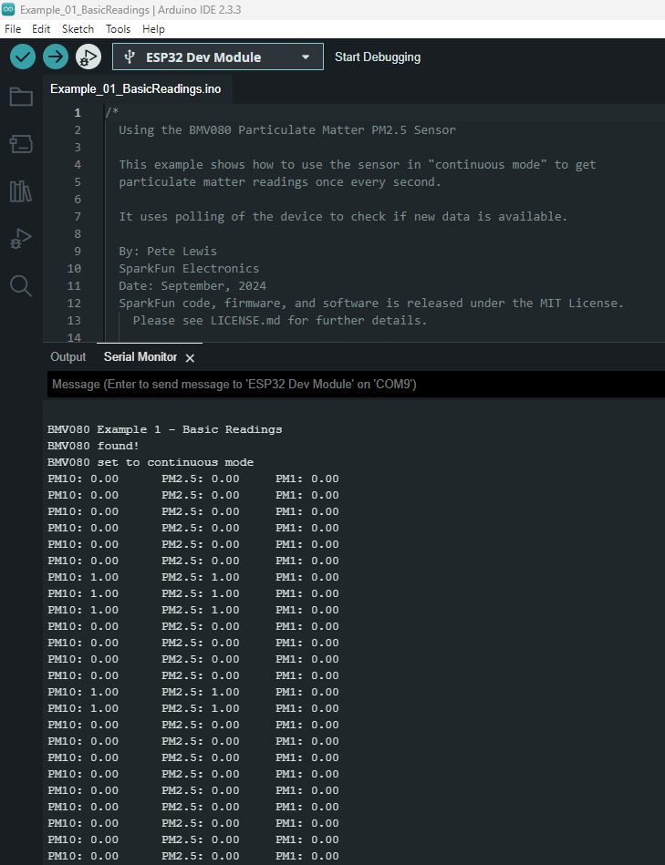

In this Quick Start guide we'll show how to get air quality measurements from the SparkFun Air Quality PM1/PM2.5/PM10 Sensor - BMV080 (Qwiic) and IoT RedBoard - ESP32 using the Arduino IDE. This guide assumes users are familiar with the Arduino IDE and Arduino development boards. You'll need the following items to follow along with this guide:

* [SparkFun Air Quality PM2/PM2.5/PM10 Sensor - BMV080 (Qwiic)](https://www.sparkfun.com/sparkfun-air-quality-pm1-pm2-5-pm10-sensor-bmv080-qwiic.html)
* [SparkFun IoT RedBoard - ESP32](https://www.sparkfun.com/sparkfun-iot-redboard-esp32-development-board.html)
* [Qwiic Cable](https://www.sparkfun.com/flexible-qwiic-cable-100mm.html)
* [USB-C Cable](https://www.sparkfun.com/reversible-usb-a-to-c-cable-0-8m.html)

If you're unfamiliar with any of the concepts covered here or would like more information about the Air Quality PM1/PM2.5/PM10 Sensor - BMV080 (Qwiic) read on to the following sections for detailed information about the BMV080 along with instructions on assembling it into a circuit, removing the breakout board from the enclosure and installing and using the BMV080 Arduino library.

## Basic Assembly

Start by connecting the Air Quality Sensor - BMV080 to the IoT RedBoard - ESP32 using a Qwiic cable and then connect the IoT RedBoard - ESP23 to your computer with a USB-C cable:

[{ width="600"}](./assets/img/BMV080_Qwiic_Assembly.jpg "Click to enlarge")

## Installing SparkFun BMV080 Arduino Library & Bosch BMV080 SDK Files

The SparkFun BMV080 Arduino library requires some manual installation as it does **not** include the required files from BMV080 SDK from Bosch. Users will need to download the SDK from [this page](https://www.bosch-sensortec.com/products/environmental-sensors/particulate-matter-sensor/bmv080/#documents) and then manually place the necessary files in the SparkFun BMV080 Arduino library folder. The tables below outlines where to find the Arduino Libraries folder along with the filepaths and filenames of all SDK files you'll need to copy into the SparkFun BMV080 Arduino folder:

### Library Install Directory

| OS | Directory|
|---|---|
|macOS | $HOME/Documents/Arduino/libraries/SparkFun_BMV080_Arduino_Library|
|Windows | $HOME\Documents\Arduino\libraries\SparkFun_BMV080_Arduino_Library|
|Linux| $HOME/Arduino/libraries/SparkFun_BMV080_Arduino_Library|

### Files to copy and locations to copy to

From the Bosch SDK, the following files are copied into the specified library locations.

|Bosch SDK File | SparkFun BMV080 Arduino Library Directory|
|--|--|
|api/inc/bmv080.h| src/sfTk/bmv080.h|
|api/inc/bmv080_defs.h| src/sfTk/bmv080_defs.h|
|api/api/lib/xtensa_esp32/xtensa_esp32_elf_gcc/release/lib_bmv080.a | src/esp32/lib_bmv080.a|
|api/api/lib/xtensa_esp32/xtensa_esp32_elf_gcc/release/lib_postProcessor.a | src/esp32/lib_postProcessor.a|
|api/api/lib/xtensa_esp32s2/xtensa_esp32s2_elf_gcc/release/lib_postProcessor.a | src/esp32s2/lib_postProcessor.a|
|api/api/lib/xtensa_esp32s2/xtensa_esp32s2_elf_gcc/release/lib_bmv080.a | src/esp32s2/lib_bmv080.a|
|api/api/lib/xtensa_esp32s3/xtensa_esp32s3_elf_gcc/release/lib_postProcessor.a | src/esp32s3/lib_postProcessor.a|
|api/api/lib/xtensa_esp32s3/xtensa_esp32s3_elf_gcc/release/lib_bmv080.a | src/esp32s3/lib_bmv080.a|
|api/api/lib/arm_cortex_m0plus/xarm_none_eabi_gcc/release/lib_postProcessor.a | src/cortex-m0plus/lib_postProcessor.a|
|api/api/lib/arm_cortex_m0plus/arm_none_eabi_gcc/release/lib_bmv080.a | src/cortex-m0plus/lib_bmv080.a|
|api/api/lib/arm_cortex_m33f/xarm_none_eabi_gcc/release/lib_postProcessor.a | src/cortex-m33/lib_postProcessor.a|
|api/api/lib/arm_cortex_m33f/arm_none_eabi_gcc/release/lib_bmv080.a | src/cortex-m33/lib_bmv080.a|
|api/api/lib/arm_cortex_m4/xarm_none_eabi_gcc/release/lib_postProcessor.a | src/cortex-m4/lib_postProcessor.a|
|api/api/lib/arm_cortex_m4/arm_none_eabi_gcc/release/lib_bmv080.a | src/cortex-m4/lib_bmv080.a|
|api/api/lib/arm_cortex_m4f/xarm_none_eabi_gcc/release/lib_postProcessor.a | src/cortex-m4f/lib_postProcessor.a|
|api/api/lib/arm_cortex_m4f/arm_none_eabi_gcc/release/lib_bmv080.a | src/cortex-m4f/lib_bmv080.a|

## Arduino Example 1 - Basic Readings

This example demonstrates the basics of initializing and reading air quality data from the BMV080 over I2C. Run "Example 01 - Basic Readings" by completing the following steps:

* If necessary, open the [Boards Manager](https://docs.arduino.cc/software/ide-v2/tutorials/ide-v2-board-manager/) tool, search for "SparkFun ESP32" and install the latest version of the SparkFun ESP boards.
* In the Examples menu, open **Example_01_BasicReadings**.
* Select the Board (SparkFun ESP32 IoT RedBoard) and Port and click "Upload".
* Open the [Serial Monitor](https://docs.arduino.cc/software/ide-v2/tutorials/ide-v2-serial-monitor) with the baud set to **115200** to view particulate matter readings from the BMV080.

[{ width="600"}](./assets/img/BMV080_Arduino_Example_01_Screenshot.png)
